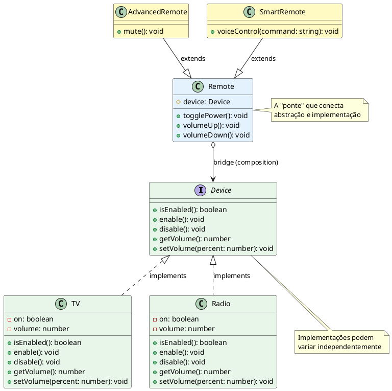

Vou melhorar a didática do padrão BRIDGE com a mesma abordagem progressiva e visual:

# Bridge Pattern 🌉

## O que é?

O Bridge é como um **controle universal**: separa a abstração (controle remoto) da implementação (dispositivo), permitindo que ambos evoluam independentemente.

---

## 🎯 O Problema Real

Imagine que você precisa criar controles remotos para diferentes dispositivos eletrônicos:

```
Tipos de Controles:          Tipos de Dispositivos:
• Basic Remote               • TV
• Advanced Remote            • Radio
• Smart Remote               • Air Conditioner
```

**Quantas classes você precisaria?**
```
3 tipos de controle × 3 tipos de dispositivo = 9 CLASSES! 😱
```

---

## ❌ Solução Ruim: Explosão de Classes

```typescript
// ❌ Uma classe para cada combinação!
class BasicRemoteForTV {
  private tv: TV = new TV();
  
  togglePower(): void { 
    this.tv.toggle(); 
  }
  
  volumeUp(): void { 
    this.tv.volumeUp(); 
  }
}

class BasicRemoteForRadio {
  private radio: Radio = new Radio();
  
  togglePower(): void { 
    this.radio.toggle(); 
  }
  
  volumeUp(): void { 
    this.radio.volumeUp(); 
  }
}

class AdvancedRemoteForTV {
  private tv: TV = new TV();
  
  togglePower(): void { this.tv.toggle(); }
  volumeUp(): void { this.tv.volumeUp(); }
  mute(): void { this.tv.mute(); } // Funcionalidade extra
}

class AdvancedRemoteForRadio {
  private radio: Radio = new Radio();
  
  togglePower(): void { this.radio.toggle(); }
  volumeUp(): void { this.radio.volumeUp(); }
  mute(): void { this.radio.mute(); }
}

// 😱 Adicionar novo dispositivo (AirConditioner)?
//    → Precisa criar BasicRemoteForAC, AdvancedRemoteForAC...
//
// 😱 Adicionar novo controle (SmartRemote)?
//    → Precisa criar SmartRemoteForTV, SmartRemoteForRadio...
```

**A catástrofe em números:**

| Cenário | Classes Necessárias |
|---------|---------------------|
| 2 controles × 2 dispositivos | **4 classes** |
| 3 controles × 3 dispositivos | **9 classes** |
| 4 controles × 4 dispositivos | **16 classes** |
| 5 controles × 5 dispositivos | **25 classes** 💀 |

**Por que isso é ruim?**
1. 💥 **Explosão combinatória**: N controles × M dispositivos = N×M classes
2. 🔄 **Código duplicado**: Lógica de volume/power repetida em TODAS as classes
3. 🔗 **Acoplamento forte**: Controle conhece detalhes do dispositivo
4. 🚫 **Violação OCP**: Adicionar novo tipo = modificar/criar múltiplas classes
5. 🧪 **Difícil manter**: Bug no volumeUp? Precisa corrigir em 9 lugares!

---

## ✅ Solução: Bridge Pattern

### Como funciona?

```
Abstração (Controle)  ──bridge──►  Implementação (Dispositivo)
     │                                    │
     ├─ Basic Remote                      ├─ TV
     ├─ Advanced Remote                   ├─ Radio
     └─ Smart Remote                      └─ Air Conditioner

     Variam independentemente! 🎉
```

O Bridge **conecta** as duas hierarquias sem criar combinações.

### Implementação

```typescript
// 1️⃣ Interface da Implementação (Device)
interface Device {
  isEnabled(): boolean;
  enable(): void;
  disable(): void;
  getVolume(): number;
  setVolume(percent: number): void;
}

// 2️⃣ Implementações Concretas (ConcreteImplementor)
class TV implements Device {
  private on: boolean = false;
  private volume: number = 30;

  isEnabled(): boolean { return this.on; }
  enable(): void { this.on = true; console.log("📺 TV ligada"); }
  disable(): void { this.on = false; console.log("📺 TV desligada"); }
  getVolume(): number { return this.volume; }
  setVolume(percent: number): void { 
    this.volume = Math.max(0, Math.min(100, percent));
    console.log(`📺 Volume da TV: ${this.volume}%`);
  }
}

class Radio implements Device {
  private on: boolean = false;
  private volume: number = 20;

  isEnabled(): boolean { return this.on; }
  enable(): void { this.on = true; console.log("📻 Rádio ligado"); }
  disable(): void { this.on = false; console.log("📻 Rádio desligado"); }
  getVolume(): number { return this.volume; }
  setVolume(percent: number): void { 
    this.volume = Math.max(0, Math.min(100, percent));
    console.log(`📻 Volume do Rádio: ${this.volume}%`);
  }
}

// 3️⃣ Abstração (Remote) - contém referência ao Device
class Remote {
  constructor(protected device: Device) {}

  togglePower(): void {
    if (this.device.isEnabled()) {
      this.device.disable();
    } else {
      this.device.enable();
    }
  }

  volumeUp(): void {
    const currentVolume = this.device.getVolume();
    this.device.setVolume(currentVolume + 10);
  }

  volumeDown(): void {
    const currentVolume = this.device.getVolume();
    this.device.setVolume(currentVolume - 10);
  }
}

// 4️⃣ Abstração Refinada (AdvancedRemote)
class AdvancedRemote extends Remote {
  mute(): void {
    console.log("🔇 Silenciando...");
    this.device.setVolume(0);
  }
}

// 5️⃣ Outra Abstração Refinada (SmartRemote)
class SmartRemote extends Remote {
  voiceControl(command: string): void {
    console.log(`🎤 Comando de voz: "${command}"`);
    if (command.includes("ligar")) this.device.enable();
    if (command.includes("desligar")) this.device.disable();
  }
}
```

### Usando na prática

```typescript
// ✅ Qualquer controle funciona com qualquer dispositivo!

// Controle básico com TV
const tv = new TV();
const basicRemote = new Remote(tv);
basicRemote.togglePower();  // 📺 TV ligada
basicRemote.volumeUp();     // 📺 Volume da TV: 40%

// Controle avançado com Rádio
const radio = new Radio();
const advancedRemote = new AdvancedRemote(radio);
advancedRemote.togglePower(); // 📻 Rádio ligado
advancedRemote.mute();        // 🔇 Silenciando...

// Controle inteligente com TV (reutilizando a mesma TV!)
const smartRemote = new SmartRemote(tv);
smartRemote.voiceControl("ligar tv"); // 🎤 Comando de voz...

// ✅ Adicionar novo dispositivo? Só implementar Device!
class AirConditioner implements Device { /* ... */ }
const ac = new AirConditioner();
const remoteForAC = new AdvancedRemote(ac); // Funciona imediatamente!
```

---

## 🏗️ Estrutura do Pattern

```
┌─────────────────┐                    ┌─────────────────┐
│     Remote      │◆───────bridge─────►│     Device      │
│  (Abstraction)  │                    │ (Implementor)   │
│                 │                    │  <<interface>>  │
│ +togglePower()  │                    │ +enable()       │
│ +volumeUp()     │                    │ +disable()      │
│ +volumeDown()   │                    │ +getVolume()    │
└────────▲────────┘                    └────────▲────────┘
         │                                      │
         │ herança                              │ implementa
         │                                      │
┌────────┴────────┐                    ┌────────┴────────┐
│ AdvancedRemote  │                    │       TV        │
│ (RefinedAbstr.) │                    │  (ConcreteImpl) │
│                 │                    │                 │
│ +mute()         │                    │ TV específico   │
└─────────────────┘                    └─────────────────┘
         │                                      │
         │                             ┌────────┴────────┐
         │                             │     Radio       │
┌────────┴────────┐                    │  (ConcreteImpl) │
│  SmartRemote    │                    │                 │
│ (RefinedAbstr.) │                    │ Radio específico│
│                 │                    └─────────────────┘
│ +voiceControl() │
└─────────────────┘
```

**Componentes:**
- **Abstraction** (Remote): define interface de alto nível, mantém referência ao Implementor
- **RefinedAbstraction** (AdvancedRemote, SmartRemote): extensões da abstração
- **Implementor** (Device): interface para implementações concretas
- **ConcreteImplementor** (TV, Radio): implementações específicas

---

## 🎁 Benefícios

| Sem Bridge | Com Bridge |
|------------|------------|
| N × M classes | N + M classes |
| Código duplicado | Reutilização máxima |
| Acoplamento forte | Desacoplamento via interface |
| Adicionar tipo = criar N classes | Adicionar tipo = 1 classe |
| Difícil trocar implementação | Fácil composição |

**Exemplo numérico:**

```
3 controles × 4 dispositivos

SEM Bridge:  3 × 4 = 12 classes
COM Bridge:  3 + 4 = 7 classes ✨
```

---

## 🔧 Diagrama PlantUML



---

## 🆚 Bridge vs Strategy vs Adapter

| Pattern | Propósito | Quando usar |
|---------|-----------|-------------|
| **Bridge** | Separa abstração de implementação | Múltiplas hierarquias que variam independentemente |
| **Strategy** | Troca algoritmos em runtime | Diferentes formas de fazer a mesma coisa |
| **Adapter** | Compatibiliza interfaces | Integrar código legado incompatível |

**Exemplo prático:**
```typescript
// Bridge: Remote + Device (duas hierarquias)
new AdvancedRemote(new TV())

// Strategy: Diferentes algoritmos de pagamento
new CheckoutService(new CreditCardStrategy())

// Adapter: Adaptar gateway legado
new PaymentAdapter(new LegacyPaymentGateway())
```

---

## 📝 Quando Usar?

✅ **Use Bridge quando:**
- Tiver duas hierarquias que variam independentemente
- Quiser evitar explosão de classes (produto cartesiano)
- Precisar trocar implementação em runtime
- A abstração e implementação devem ser extensíveis por herança
- Quiser ocultar detalhes de implementação do cliente

❌ **Não use quando:**
- Tiver apenas uma dimensão de variação (use herança simples)
- A abstração e implementação são fixas
- A complexidade adicional não se justifica

---

## 💡 Exemplo Real: Sistema de Notificações

```typescript
// Abstração: Tipos de Notificação
abstract class Notification {
  constructor(protected sender: MessageSender) {}
  abstract send(message: string): void;
}

class UrgentNotification extends Notification {
  send(message: string): void {
    this.sender.sendMessage(`🚨 URGENTE: ${message}`);
  }
}

class RegularNotification extends Notification {
  send(message: string): void {
    this.sender.sendMessage(`📬 ${message}`);
  }
}

// Implementação: Canais de Envio
interface MessageSender {
  sendMessage(message: string): void;
}

class EmailSender implements MessageSender {
  sendMessage(message: string): void {
    console.log(`📧 Email: ${message}`);
  }
}

class SMSSender implements MessageSender {
  sendMessage(message: string): void {
    console.log(`📱 SMS: ${message}`);
  }
}

// Uso: 2 tipos × 2 canais = 4 combinações com apenas 4 classes!
const urgentEmail = new UrgentNotification(new EmailSender());
urgentEmail.send("Servidor fora do ar!");

const regularSMS = new RegularNotification(new SMSSender());
regularSMS.send("Seu pedido foi enviado");
```

---

## 🎓 Resumo em uma frase

> **Bridge desacopla abstração de implementação criando uma "ponte" entre duas hierarquias independentes, permitindo que ambas evoluam sem explodir o número de classes.**

---

## 🔑 Dica de Ouro

**Como identificar a necessidade de Bridge?**

Se você está pensando:
- "Preciso criar ClasseAParaB, ClasseAParaC, ClasseCParaB..." ❌
- "Tenho N tipos de X e M tipos de Y = N×M classes" ❌
- "Não consigo adicionar novo tipo sem criar muitas classes" ❌

**Então você precisa de Bridge!** ✅

```
Pense em: "Tenho duas dimensões que variam? 
          Posso conectá-las com composição?"
```

