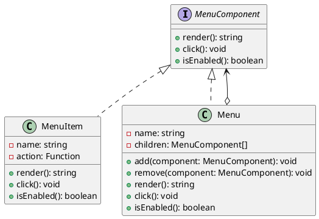

# Exercício 1: Sistema de Menu Hierárquico

## 📋 Descrição do Problema

Crie um sistema de menu onde você precisa tratar menus e submenus de forma uniforme. Tanto um item de menu individual quanto um menu que contém outros menus podem ser renderizados, ativados ou desabilitados da mesma forma.

O problema é que sem Composite, você precisa tratar menus e itens de forma diferente, tornando o código complexo.

## 🎯 Objetivo

Implementar o padrão **Composite** para tratar menus e submenus uniformemente.

## 📐 Sugestão de Solução (PlantUML)

## ✅ Critérios de Avaliação

1. ✅ Interface `MenuComponent` comum
2. ✅ Classe `MenuItem` (folha)
3. ✅ Classe `Menu` (composite) que contém componentes
4. ✅ Cliente trata menu e item da mesma forma
5. ✅ Testes validando menus aninhados

## 💡 Dicas

- MenuItem implementa ação diretamente
- Menu delega para filhos (recursivamente)
- Método `render()` concatena renderização de filhos

