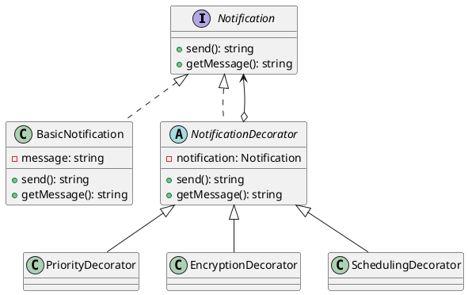

# Exercício 1: Sistema de Notificações com Extras

## 📋 Descrição do Problema

Crie um sistema de notificações onde você pode adicionar funcionalidades extras (prioridade, criptografia, agendamento) a uma notificação básica sem modificar a classe base.

O problema é que sem Decorator, você teria uma classe para cada combinação (BasicNotification, PriorityNotification, EncryptedNotification, PriorityEncryptedNotification, etc.), causando explosão de classes.

## 🎯 Objetivo

Implementar o padrão **Decorator** para adicionar funcionalidades dinamicamente.

## 📐 Sugestão de Solução (PlantUML)

## ✅ Critérios de Avaliação

1. ✅ Interface `Notification` comum
2. ✅ Classe `BasicNotification` (componente base)
3. ✅ Classe abstrata `NotificationDecorator` que mantém referência
4. ✅ Decorators concretos adicionam funcionalidades
5. ✅ Testes validando combinações de decorators

## 💡 Dicas

- Decorator delega para o componente decorado
- Adicione funcionalidade antes ou depois da delegação
- Permita múltiplos decorators aninhados

