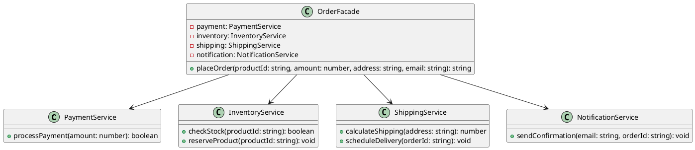

# Exercício 1: Sistema Simplificado de Compra Online

## 📋 Descrição do Problema

Crie um sistema de compra online que precisa interagir com múltiplos subsistemas complexos:
- **PaymentService**: processa pagamentos
- **InventoryService**: verifica estoque
- **ShippingService**: calcula frete
- **NotificationService**: envia confirmação

O problema é que o cliente precisa conhecer todos esses serviços e coordená-los, tornando o código complexo e acoplado.

## 🎯 Objetivo

Implementar o padrão **Facade** para fornecer uma interface simples para o subsistema complexo.

## 📐 Sugestão de Solução (PlantUML)

## ✅ Critérios de Avaliação

1. ✅ Múltiplos serviços do subsistema
2. ✅ Classe `OrderFacade` que coordena serviços
3. ✅ Método `placeOrder()` simplifica processo complexo
4. ✅ Cliente usa apenas a Facade
5. ✅ Testes validando fluxo completo de compra

## 💡 Dicas

- Facade coordena múltiplos serviços
- Método `placeOrder()` chama serviços na ordem correta
- Esconde complexidade do cliente

