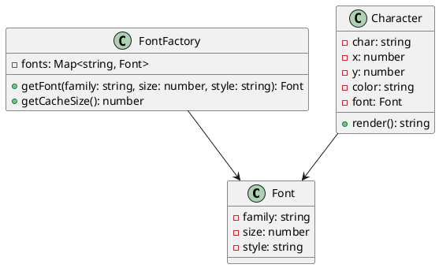

# Exercício 1: Sistema de Renderização de Texto Eficiente

## 📋 Descrição do Problema

Crie um sistema de renderização de texto que precisa renderizar milhares de caracteres na tela. Cada caractere tem propriedades compartilhadas (fonte, tamanho, estilo) e propriedades únicas (posição, cor).

O problema é que criar um objeto para cada caractere com todas as propriedades seria muito custoso em memória.

## 🎯 Objetivo

Implementar o padrão **Flyweight** para compartilhar propriedades intrínsecas (fonte, tamanho) entre caracteres.

## 📐 Sugestão de Solução (PlantUML)

## ✅ Critérios de Avaliação

1. ✅ Classe `Font` (flyweight) com propriedades intrínsecas
2. ✅ Classe `FontFactory` que gerencia cache de fonts
3. ✅ Classe `Character` (context) com propriedades extrínsecas
4. ✅ Múltiplos caracteres compartilham a mesma font
5. ✅ Testes validando economia de memória

## 💡 Dicas

- Font contém propriedades compartilhadas (intrínsecas)
- Character contém propriedades únicas (extrínsecas)
- FontFactory cria e compartilha fonts
- Use chave única para identificar font (ex: "Arial-12-bold")

