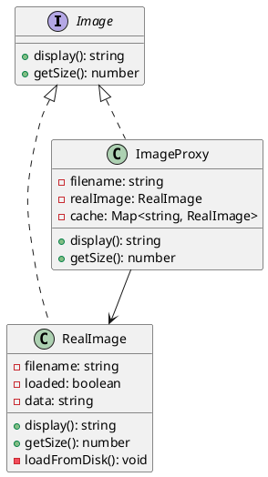

# Exercício 1: Sistema de Cache de Imagens

## 📋 Descrição do Problema

Crie um sistema que precisa carregar imagens de forma eficiente. Carregar todas as imagens imediatamente seria muito custoso. O sistema deve carregar imagens apenas quando necessário (lazy loading) e cachear para evitar recarregamentos.

## 🎯 Objetivo

Implementar o padrão **Proxy** para controlar acesso a imagens com lazy loading e cache.

## 📐 Sugestão de Solução (PlantUML)

## ✅ Critérios de Avaliação

1. ✅ Interface `Image` comum
2. ✅ Classe `RealImage` que carrega do disco
3. ✅ Classe `ImageProxy` que controla acesso
4. ✅ Proxy carrega apenas quando necessário
5. ✅ Testes validando lazy loading e cache

## 💡 Dicas

- Proxy cria RealImage apenas quando necessário
- Cache para evitar recarregamentos
- Proxy delega para RealImage após carregar

